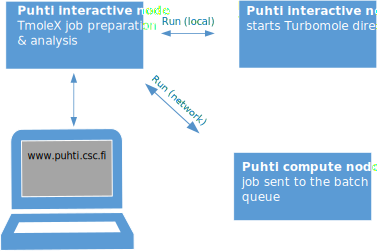

# Setup TmoleX

[TmoleX](https://www.3ds.com/products/biovia/turbomole ) is an easy to use graphical user interface to handle [TURBOMOLE](https://www.turbomole.org/turbomole/turbomole-features/) calculations. TmoleX includes a structure builder and tools for preparing TURBOMOLE jobs and analyzing results. TmoleX can also be used to submit and supervise TURBOMOLE jobs on CSC's supercomputers.


The free TmoleX Client version can be used from your local Windows, Linux, or MacOS desktop to run TURBOMOLE at CSC. It can be freely downloaded (requires registration) from the [Dassault Systèmes website](https://discover.3ds.com/free-download-biovia-turbomole-demo-version). This is a demo version that also includes a restricted version of TURBOMOLE.

<div style="display: flex; gap: 20px; justify-content: space-between;">
  <figure style="width: 45%; text-align: center;">
    
    <figcaption>Using TmoleX via browser</figcaption>
  </figure>
  <figure style="width: 45%; text-align: center;">
    
    <figcaption>Using TmoleX from local computer</figcaption>
  </figure>
</div>
             

## Usage

### Use via your browser

Go to [puhti.csc.fi](https://puhti.csc.fi/) using a web browser and login using
your CSC/Haka user account.

1. From there [launch a Desktop](https://docs.csc.fi/computing/webinterface/desktop/#launching).
<<<<<<< HEAD
		
=======


		
>>>>>>> d7ec63a (Update site and fix broken files)
   * Activate the `Reservation-> sscc_thu_small` that gives access to resourses specially dedicated for this course 
   * Select the project `project_2013760(SSCC2025)` that is used for this course 
   * Go with the default resourses	
   * Once resourses have been allocated `Launch Desktop`  
2. Open a `Terminal` and load the TURBOMOLE module `module load turbomole/7.8`.
3. Start TmoleX with the command `TmoleX24`.
4. Select `New Project` and define a suitable project in the `File Name` slot
   (e.g. `/scratch/project_2013760/<your-username>/qc_tutorial1`).
   In the menu `Extras->Preferences->General` you can set the `User directory` to point to you present directory `/scratch/project_2013760/<your-username>`
5. Define your system and type of calculation. 
6. Small jobs can be run interactively: Start Job -> Run (local)
7. Larger jobs should be run as batch jobs: Start Job -> Run (network).


### Prepare for batch jobs

Smaller jobs can be run directly (`Run (local)`), but for larger jobs we should reserve  
resourses via the queuing system. 
<<<<<<< HEAD

1. In `Extras->Remote Systems->Add new Machine`
2. The Machine is called `puhti-login12.bullx`
3. User is your CSC username, Group name and Identification are just tags you can seti however you like
=======


1. In `Extras->Remote Systems->Add new Machine`
2. The Machine is called `puhti-login12.bullx`
3. `User` is your CSC username, `Group name` and `Identification` are just tags you can set to distinguish different configurations
>>>>>>> d7ec63a (Update site and fix broken files)
4. Tick `Expert settings`and `no password`.
5. Work directory is a place where temporary files are stored:
   /scratch/project_2013760/<your-username>/TM_TMPDIR 
6. TURBOMOLE directory should point to were it is installed:
   /appl/soft/chem/turbomole/7.8/TURBOMOLE

7. Tick `Use queuing system`
8. Submit with `sbatch` and Check status with  `squeue -u $USER`
9. Untick `add PARA_ARCH` and `add PARNODES`    
10. In the field "Script before job execution" add:
 
```bash
#SBATCH --reservation=sscc_thu_small                  # resource reservation for school
#SBATCH --partition=small                             # queue
#SBATCH --nodes=1                                     # for SMP only 1 is possible
#SBATCH --cpus-per-task=4                             # SMP threads
#SBATCH --account=project_2013760                     # insert here the project to be billed
#SBATCH --time=00:30:00                               # time as `hh:mm:ss`
source /appl/profile/zz-csc-env.sh
ulimit -s unlimited
export PARA_ARCH=SMP                                  # use SMP threads
module load turbomole/7.8
export PARNODES=$SLURM_CPUS_PER_TASK                  # for SMP
export PATH=$TURBODIR/bin/`$TURBODIR/scripts/sysname`:$PATH
```


11. **Remember to save save the settings using `Save Machine`.**   


 
### Install your own TmoleX

Install the TmoleX client on your local workstation. For details, see the
registration and download page at
[Dassault Systèmes website](https://discover.3ds.com/free-download-biovia-turbomole-demo-version).
With your version of TmoleX you can build your actual job locally and then
submit the job to Puhti. With the client you can monitor how the job proceeds.
When the job has completed you can retrieve the output and use your local
client to analyze the results.

