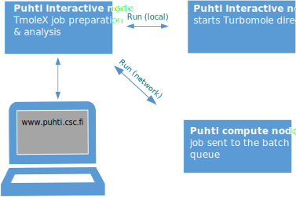
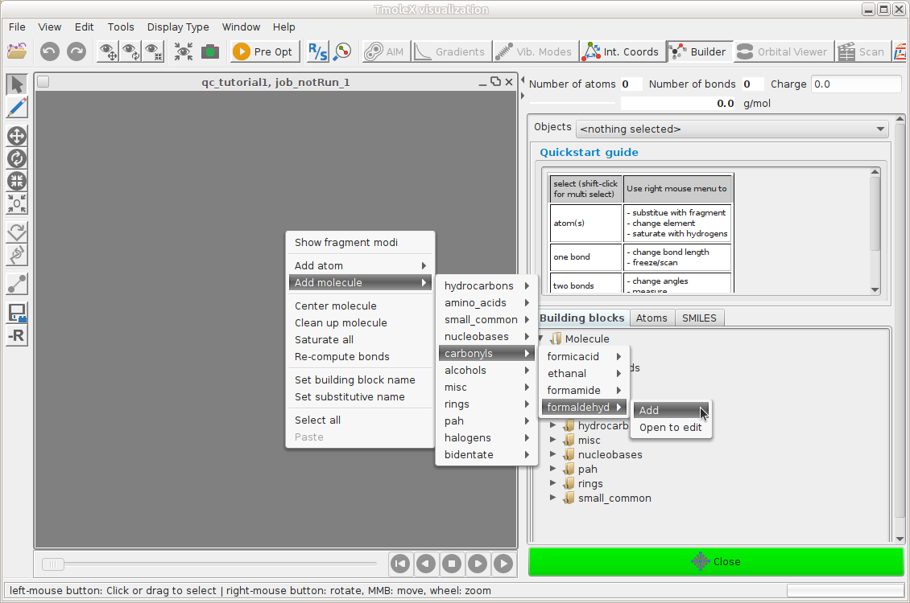
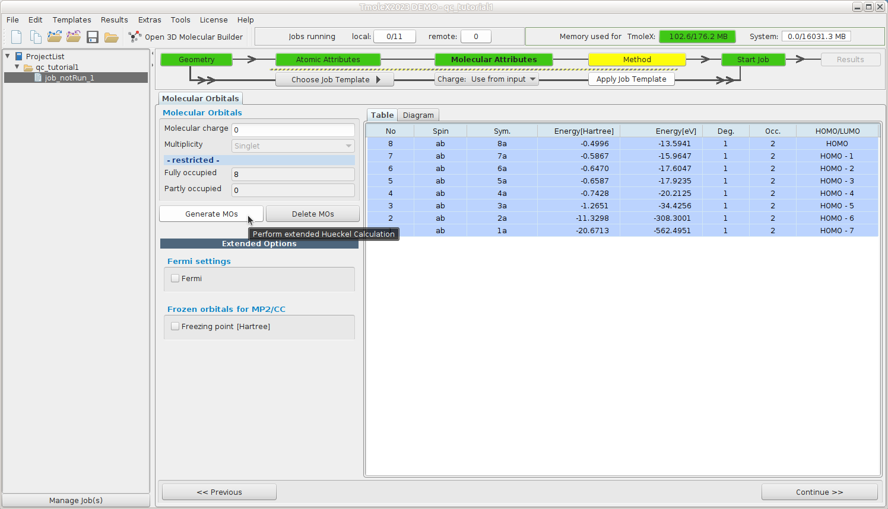
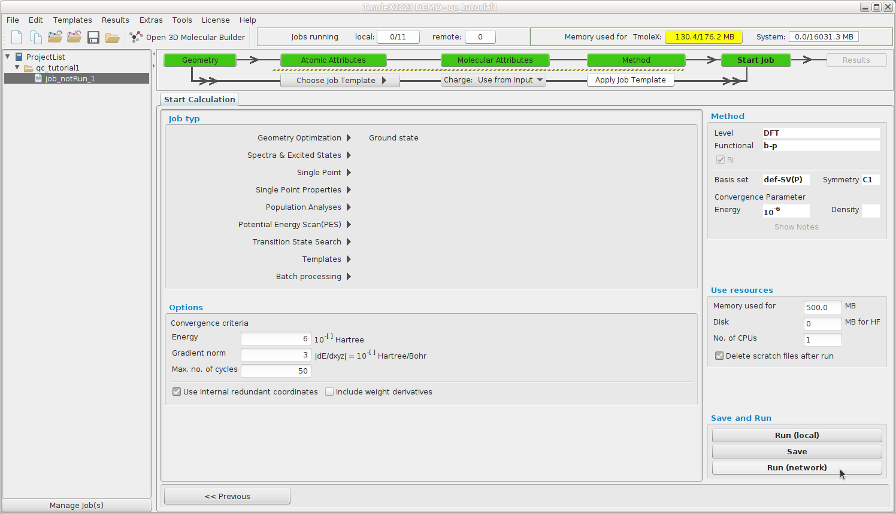
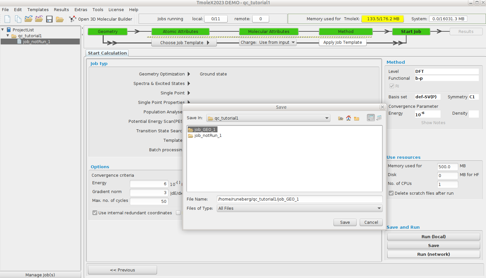
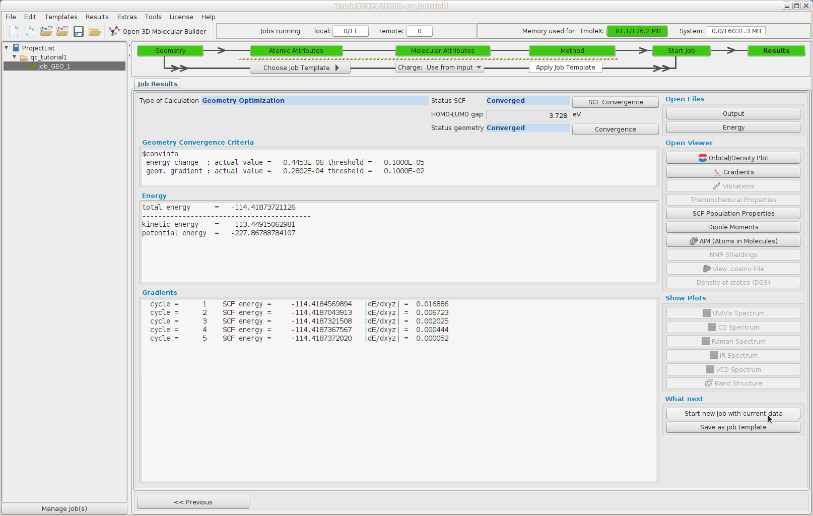
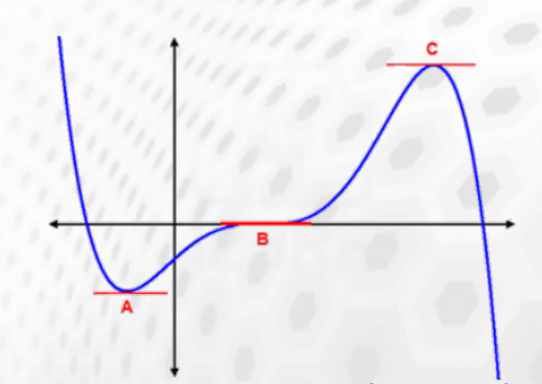

# Tutorial 1: Basic DFT calculations using TmoleX and TURBOMOLE

* Spring School on Computational Chemistry 23-25 April 2025
* Nino Runeberg, CSC - IT center for Science Ltd, based on the earlier work of Atte Sillanpää

## Overview

1. TmoleX is a graphical user interface to set up, launch and run jobs with TURBOMOLE
1. This tutorial is made for use with TmoleX 24 and TUBOMOLE 7.8
1. We'll use TmoleX to set up a formaldehyde geometry optimization
1. Configure and submit the job to be run on puhti.csc.fi supercomputer
1. Perform a subsequent frequency calculation on the optimized structure
1. Visualize results

## TmoleX setup at CSC

* TmoleX can be used either via a browser or by running it on your local 
  computer (see [Preparations](../preparations/README.md) )   
* The model system and input parameters for the TUBOMOLE job are specified  using TmoleX
* A connection to puhti.csc.fi is set up in TmoleX using ssh (Only passwordless ssh allowed)
* Installation directory and supercomputer specific options are set in TmoleX so that the GUI can
  launch the job for the queueing system (SLURM) on the Puhti
* TmoleX can follow the progress and once the job has completed, the results are retreived
* The [CSC TmoleX page](https://docs.csc.fi/apps/tmolex/) has more information 
* The overall CSC supercomputer environment can be found in the [Docs CSC user guide](https://docs.csc.fi/computing/available-systems/)
  or in the [CSC Computing environment self learning course materials](https://csc-training.github.io/csc-env-eff/).
* TURBOMOLE can also be used directly from the Puhti command line.

<div style="display: flex; gap: 20px; justify-content: space-between; align-items: flex-end;">
  <figure style="width: 45%; text-align: center; margin: 0;">
<a href="../img/tmolex-and-ood.svg" class="lightbox">
    
    <figcaption>Using TmoleX via the browser</figcaption>
</a>
  </figure>
  <figure style="width: 45%; text-align: center; margin: 0;">
<a href="../img/tmolex-and-puhti_new.svg" class="lightbox">
    
    <figcaption>Using TmoleX from local pc</figcaption>
  </figure>
</a>

</div>

## Task 1: Optimize the ground state for formaldehyde
We need an initial guess for the geometry specifying the 3N-6 internal
nuclear coordinates. This initial structure place the system on the
energy surface that is uniquely defined by the computational model
we are going to use (B-O approx.).  The performance of the model
often vary at different parts of the surface.

[](../img/pesurf.png)

<h3><span data-toc-label="New project">Launch TmoleX and create a new project</span></h3>

#### Use via your browser

Go to [puhti.csc.fi](https://puhti.csc.fi/) using a web browser and login using
your CSC/Haka user account.

1. From there [launch a Desktop](https://docs.csc.fi/computing/webinterface/desktop/#launching). 
2. Open a `Terminal` and load the TURBOMOLE module `module load turbomole/7.8`.
3. Start TmoleX with the command `TmoleX24`.
[](../img/ood_03.png)
4. Select `New Project` and define a suitable project in the `File Name` slot
   (e.g. `/scratch/project_2013760/<your-username>/qc_tutorial1`).
[](../img/ood_04.png)
5. Define your system and type of calculation. 
6. Small jobs can be run interactively: Start Job -> Run (local)
7. Larger jobs should be run as batch jobs: Start Job -> Run (network). Example
   settings are given below. Note that passwordless connection doesn't work via
   the browser. Remember to save the settings using `Save Machine`.
 
####  Use locally installed TmoleX

* If you have installed TmoleX on your own laptop, launch it from icon/menu
* On the CSC workstations TmoleX is already installed, launch it from icon/menu
* Note. TmoleX warns about not finding a license. This is ok. We'll use the TURBOMOLE license
on Puhti for the calculations. Accept the dialog.
* Define a suitable project directory (e.g. `~/qc_tutorial1`).

[](../img/local_1.png)

### Define your first turbomole job

[](../img/local_2.png)

A complete Turbomole job comprises the sequence:

* **Geometry - Atomic Attributes - Molecular Attributes - Method - Start Job - Results**

The TURBOMOLE philosophy or program structure is based on running different
"modules" one after another. The following diagram
[taken from a TURBOMOLE tutorial](https://www.turbomole.org/wp-content/uploads/2019/10/Tutorial_7-4.pdf)
highlights the most typical ones and their relation.


### **Geometry** -- Build formaldehyde

Open the 3D builder, right-click on canvas and load formaldehyde from the library
[](../img/local_3.png)

Close the builder and continue to Atomic Attributes

### Atomic Attributes: Select basis set

Select the default def-SV(P) basis set

[](../img/local_4.png)	

Continue to Molecular Attributes

### Molecular Attributes -- Generate initial guess MOs

Generate initial MOs by doing an extended Hückel calculation

[](../img/local_5.png)

Continue to Method

### Method -- Define your method

Select the default method (ri-dft BP86/m3)

[](../img/local_6.png)

Continue to Start Job

### Start Job -- Define your job type

We want to do a geometry optimization of the ground state.

[](../img/local_7.png)

Smaller jobs can be run directly, `Run (local)`, but for larger jobs we should reserve
resourses via the queuing system.  Continue to `Run (network)`

### Run(network) -- Setup remote job

Click **Save** as the first dialog prompts for the folder to use for the job files.
[](../img/local_8.png)

In the new dialog, we define the remote (Puhti) configuration:

 * Which user account and project to use
 * Where TURBOMOLE is installed etc.
 * What type of resources we want to use for this job

TURBOMOLE can be run in parallel either via a shared memory approach (SMP, only within a single node) or 
by using MPI parallelization (possible to run a job over several nodes). In this tutorial we will use the SMP version.

Smaller jobs can be run directly (`Run (local)`), but for larger jobs we should reserve  
resourses via the queuing system. 
[](../img/tmolex_7.png)

1. The Machine is called `puhti-login12.bullx`
2. `User` is your CSC username, `Group name` and `Identification` are just tags you can set to distinguish different configurations
3. Tick `Expert settings`and `no password`.
    *  Check that the access works by clicking `Check Password Settings` 
4. Work directory is a place where temporary files are stored:
   `/scratch/project_2013760/<your-username>/TM_TMPDIR` 
5. TURBOMOLE directory should point to were it's installed:
   `/appl/soft/chem/turbomole/7.8/TURBOMOLE`
6. Tick `Use queuing system`
7. Submit with `sbatch` and Check status with  `squeue -u $USER`
8. Untick `add PARA_ARCH` and `add PARNODES`    
9. In the field "Script before job execution" add:
 
```bash
#SBATCH --reservation=sscc_thu_small                  # resource reservation for school
#SBATCH --partition=small                             # queue
#SBATCH --nodes=1                                     # for SMP only 1 is possible
#SBATCH --cpus-per-task=4                             # SMP threads
#SBATCH --account=project_2013760                     # insert here the project to be billed
#SBATCH --time=00:30:00                               # time as `hh:mm:ss`
source /appl/profile/zz-csc-env.sh
ulimit -s unlimited
export PARA_ARCH=SMP                                  # use SMP threads
module load turbomole/7.8
export PARNODES=$SLURM_CPUS_PER_TASK                  # for SMP
export PATH=$TURBODIR/bin/`$TURBODIR/scripts/sysname`:$PATH
```
*  **Remember to save save the settings using `Save Machine`.**   
*   Click **Start Job** at the bottom right

* For this tutorial, the default 1 minute interval to ping Puhti for the job status is ok, but for actual production jobs, that could be increased to e.g. 1 hour. The status can always be refreshed manually. This job should finish in seconds.

[](../img/local_12.png)

### Results -- structure

The geometry optimization needed 5 cycles to reach the stationary point on the energy surface.

[](../img/local_13.png)

### Results -- Gradients

The length of the arrows show how steep the energy surface is in that direction

[](../img/local_14.png)

At the end of the geometry optimization we have reached a stationary point
(gradient smaller than a given threshold) that could correspond to:

[](../img/stationaryPoints.png "Stationary points on potential energy surface")

* a minimum **A**
* inflection point **B**
* a maximum **C**

The nature of the stationary point can be deduced from the curvature (Hessian).
A positive curvature corresponds to a minimum, a negative to a maximum.

### Vibrational spectrum

In order to verify that the stationary point is a true minimum
(positive curvature in all directions = real frequencies)

Start a frequency calculation (Reuse data by just hitting "Start new job by using current data as input" )


In the "Job typ" list select "Spectra & Excited States --> IR & vibrational frequencies"

Select "Run (Network)" to launch the job.

Once the job finishes (you can refresh the view - wait for results to be retreived).
You can also open a separate terminal on your Desktop (or ssh from your local pc),
and follow the job status with slurm commands directly, e.g. with:

```bash
squeue -u $USER # my current running or queuing jobs
sacct           # my ended jobs for the last day
sacct -X -o jobid,start,jobname,state,elapsed,alloc # last jobs with custom fields
```
More on these in [CSC Computing Environment self learning materials](https://csc-training.github.io/csc-env-eff/hands-on/batch_resources/tutorial_sacct_and_seff.html)

A local terminal on Puhti also gives access to some additional tools and scripts
that come with TURBOMOLE that can be nice to follow or post process the data. You
can find these e.g.

```bash
module load turbomole/7.8
ls $TURBODIR/scripts/
cgnce -h # to get help on usage
actual -h 
```

Once the job has finished we note that all calculated frequencies are real, indicating that the structure corresponds to a true minimum.

[](../img/local_19.png)

The zero Kelvin minimum energy structure in a vacuum is often the starting point in solving
chemical problems. It often represents surprisingly well the molecular properties despite
all the approximations made. What could you use this information for? How to validate or improve
the model?

This ends the tutorial.


